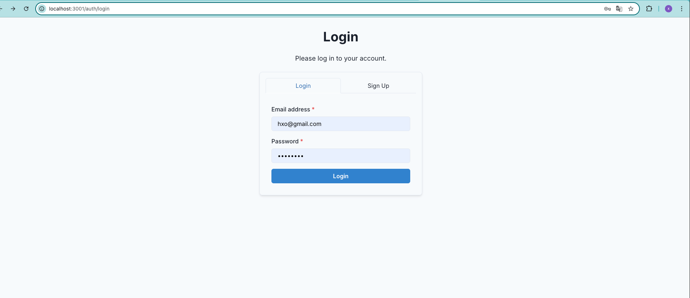
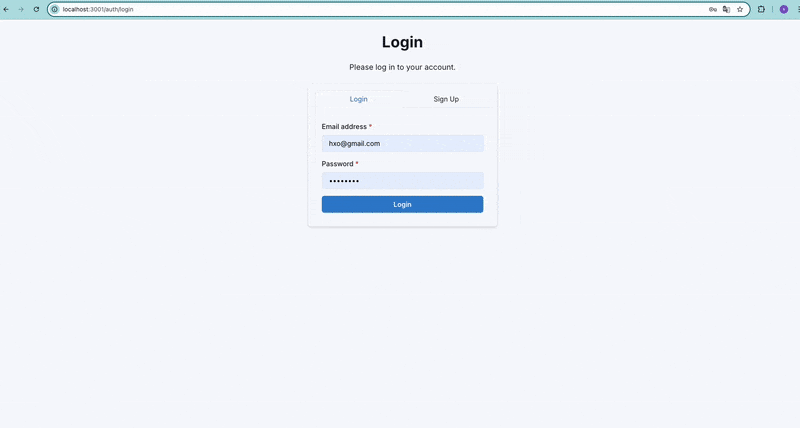
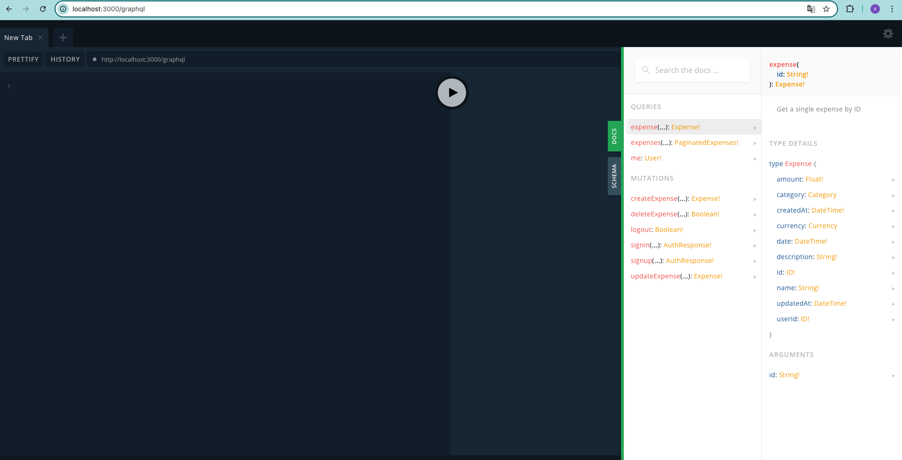

# Expense Tracker - Full-Stack Application

<p align="center">
  
  
  <a href="https://github.com/oanh-go-huynh/expenses-tracker"></a>
</p>

<p align="center">
  <em>A modern, full-stack application for managing personal expenses, featuring a NestJS backend and a Next.js frontend, all containerized with Docker. View the project on <a href="https://github.com/oanh-go-huynh/expenses-tracker">GitHub</a>.</em>
</p>

## 🌟 Overview

This project is a comprehensive solution for tracking expenses. It allows users to register, log in, and manage their expenses through a clean and interactive user interface. The backend provides a robust GraphQL API, while the frontend offers a seamless user experience. The entire application is containerized using Docker for easy setup, development, and deployment.

## ✨ Features

  * **User Authentication**: Secure JWT-based registration and login.
  * **Expense Management**: Full CRUD (Create, Read, Update, Delete) operations for expenses.
  * **Interactive Dashboard**: View key statistics and manage expenses.
  * **Advanced Filtering & Sorting**: Easily find expenses with powerful table controls.
  * **Real-time Updates**: Data is fetched and updated efficiently.
  * **Responsive Design**: User interface adapts to different screen sizes.
  * **Caching Layer**: Backend uses Redis for improved query performance.
  * **Containerized**: Entire stack managed by Docker Compose.

## 🛠️ Tech Stack

| Component      | Technologies                                                                                                |
| :------------- | :---------------------------------------------------------------------------------------------------------- |
| **Frontend** | Next.js, React, TypeScript, Chakra UI, Apollo Client                                                        |
| **Backend** | NestJS, TypeScript, GraphQL, PostgreSQL, Prisma ORM, Redis                                                  |
| **Database** | PostgreSQL                                                                                                  |
| **Caching** | Redis                                                                                                       |
| **DevOps** | Docker, Docker Compose                                                                                      |

## 📂 Project Structure

```
.
├── backend/            # NestJS GraphQL API, Prisma, Database, Caching
│   ├── prisma/
│   ├── src/
│   ├── Dockerfile
│   ├── docker-entrypoint.sh
│   ├── package.json
│   └── README.md         <-- Backend specific details
├── frontend/           # Next.js React Frontend, Chakra UI, Apollo Client
│   ├── src/
│   ├── public/
│   ├── Dockerfile
│   ├── package.json
│   └── README.md         <-- Frontend specific details
├── infrastructure/     # AWS CDK code for cloud deployment (Future Development)
│   ├── bin/
│   ├── lib/
│   ├── package.json
│   └── README.md         <-- Infrastructure specific details
├── docker-compose.yml  # Docker Compose configuration for all services
└── README.md           # You are here (Project Root Overview)
```

## 📷 Screenshots / Demo

Here's a sneak peek of the Expense Tracker in action:

### Frontend - Authentication


### Frontend - Dashboard


### Backend - GraphQL Playground



## 🚀 Getting Started

This project is designed to be run using Docker and Docker Compose.

### Prerequisites

  * [Docker Desktop](https://www.docker.com/products/docker-desktop/) (which includes Docker Compose)

### Installation & Setup

1.  **Clone the repository:**

    ```bash
    git clone https://github.com/oanh-go-huynh/expenses-tracker.git
    cd expenses-tracker
    ```

2.  **Configure Backend Environment Variables:**
    Navigate to the `backend` directory and create a `.env` file by copying the example:

    ```bash
    cd backend
    cp .env.example .env
    ```

    Open the newly created `.env` file and **change `JWT_SECRET`** to a strong, unique secret key. The default database and Redis connection strings are already configured for Docker Compose.

    ```bash
    cd .. 
    ```

    Return to the root directory.

3.  **Configure Frontend Environment Variables (if needed):**
    The `docker-compose.yml` already sets `NEXT_PUBLIC_GRAPHQL_ENDPOINT` for the frontend service. If you need other environment variables for the frontend during local Docker development, you can modify the `environment` section for the `frontend` service in `docker-compose.yml` or manage them via a `.env` file loaded by your Next.js Docker setup (if configured to do so). For standard local Next.js development (outside Docker), you would use a `.env.local` file in the `frontend` directory.

4.  **Build and Run the Application with Docker Compose:**
    From the **root directory** of the project (`expenses-tracker`), run:

    ```bash
    docker-compose up --build -d
    ```

      * `--build`: Forces Docker to rebuild the images if there are changes to Dockerfiles or source code.
      * `-d`: Runs the containers in detached mode (in the background).

    The first time you run this, it might take a few minutes to download images and build your application containers. Subsequent startups will be much faster.

### Accessing the Application

Once the containers are up and running:

  * **Frontend Application:** [http://localhost:3001](https://www.google.com/search?q=http://localhost:3001)
  * **Backend GraphQL Playground:** [http://localhost:3000/graphql](https://www.google.com/search?q=http://localhost:3000/graphql)
  * **pgAdmin (Database Management):** [http://localhost:8080](https://www.google.com/search?q=http://localhost:8080) (Login with credentials from `docker-compose.yml`)

To stop all running containers:

```bash
docker-compose down
```

To stop and remove volumes (like database data, if you want a completely fresh start):

```bash
docker-compose down -v
```

## 📖 Further Development

For more detailed information on developing specific parts of the application, refer to their individual README files:

  * **Backend README:** [https://github.com/oanh-go-huynh/expenses-tracker/blob/main/backend/README.md](https://github.com/oanh-go-huynh/expenses-tracker/blob/main/backend/README.md)
  * **Frontend README:** [https://github.com/oanh-go-huynh/expenses-tracker/blob/main/frontend/README.md](https://github.com/oanh-go-huynh/expenses-tracker/blob/main/frontend/README.md) 
  * **Infrastructure README:** [https://github.com/oanh-go-huynh/expenses-tracker/blob/main/infrastructure/README.md](https://github.com/oanh-go-huynh/expenses-tracker/blob/main/infrastructure/README.md) 

## ☁️ Cloud Infrastructure & CI/CD (Future Development)

While this project is currently set up for easy local development and execution using Docker Compose, a robust cloud infrastructure has been defined for future deployment to AWS.

### AWS Infrastructure (CDK)

  * The `infrastructure/` directory contains AWS Cloud Development Kit (CDK) code written in TypeScript.
  * This code is designed to provision a scalable and secure cloud environment including:
      * A custom VPC with public and private subnets.
      * Amazon Aurora Serverless v2 (PostgreSQL) for the database.
      * Amazon ElastiCache for Redis for caching.
      * Amazon ECR for storing Docker images.
      * AWS Fargate on ECS for running the containerized backend service with an Application Load Balancer.
      * AWS Amplify Hosting for deploying and hosting the Next.js frontend.
  * **Current Status:** Implementing and deploying this AWS infrastructure is a planned next step. This currently represents a well-defined piece of technical debt to transition the application from a Docker Compose setup to a scalable cloud environment.

### Continuous Integration/Continuous Deployment (CI/CD)

  * A CI/CD pipeline is a critical component for automating the build, test, and deployment process for both the frontend and backend applications to the AWS infrastructure outlined above.
  * This is also planned for future implementation, likely using tools such as GitHub Actions or AWS CodePipeline.

## 📄 License

This project is licensed under the MIT License. (You can add a `LICENSE` file with the MIT license text if you wish).